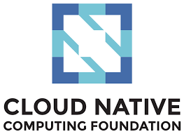
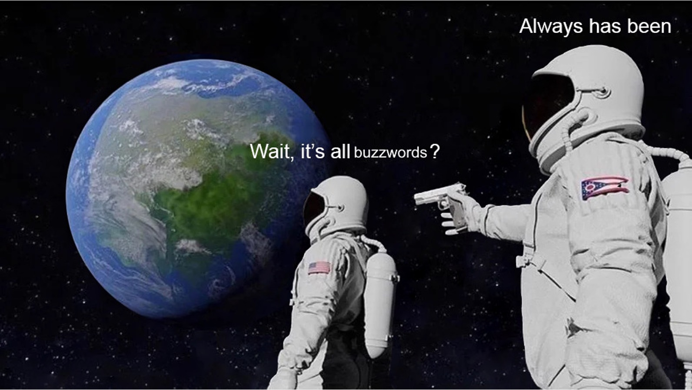

# DevOps dev blog naar aanleiding van onderzoek

Hier vind je de blog posts van studenten van de minor DevOps over hun onderzoek naar technologien uit de [Cloud Native Computing Foundation](https://landscape.cncf.io/) (CNCF) en andere DevOps tools, frameworks, talen etc.

Waar vind je verder nog zo'n verzameling Nederlandstalig DevOps blogs!? Die je helpen om de pareltjes te vinden, de disruptive technologies, tussen alle one day flies en de 'only buzz' tech.

Per 2022 zijn blog posts geschreven met hulp van ChatGPT. Maar moeten studenten uiteraard wel door prompten en handmatig aanpassen totdat het ook echt zinnig is. Daarnaast presenteren studenten eind van de week kort hun onderzoeksbevindingen in korte pitches die zij in teamverband geven.

Met dank aan alle studenten!

*[Bart van der Wal, docent minor DevOps](mailto:bart.vanderwal@han.nl)*

<figure align="right">
    
    <figcaption>Figuur 1: Een dag niet gememe'd, is een dag niet geleefd :)</figcaption>
</figure>
