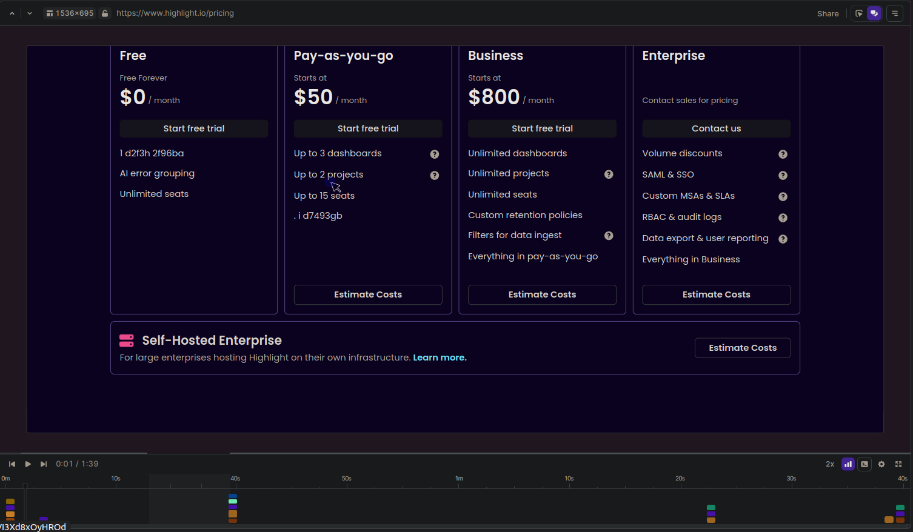
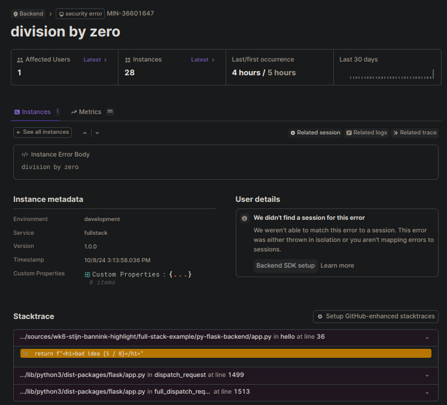
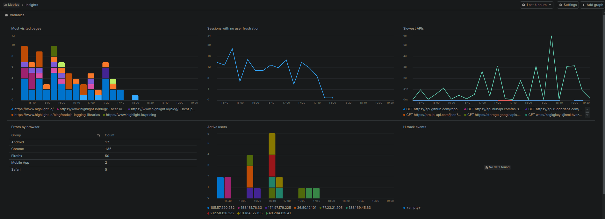

# Full-stack monitoring met Highlight.io


*[Stijn Bannink, oktober 2024.](https://github.com/hanaim-devops/stijn-bannink-devops-blog)*
<hr/>

## Inleiding

Hightlight.io is een uitgebreide monitoring tool voor applicaties, die ook ingezet kan worden in een
microservices-architectuur. In dit onderzoek wordt gekeken naar de kernfunctionaliteiten van de tool, hoe je de tool
integreert in de frontend en backend van een microservices-applicatie en welke uitdagingen er zijn bij het implementeren
van de tool in een microservices-architectuur.

## Onderzoeksvraag

### Hoofdvraag

Hoe zorgt Highlight.io voor effectieve monitoring en foutopsporing in een microservices-applicatie?

### Deelvragen

1. Wat zijn de kernfunctionaliteiten van de tool?
2. Hoe integreer je de tool in de frontend van een microservices-applicatie?
3. Hoe ziet deze integratie in de frontend eruit?
4. Hoe pas je de tool aan de backend toe van een microservices-applicatie?
5. Hoe ziet deze integratie in de backend eruit?
6. Welke uitdagingen zijn er bij het implementeren van de tool in een microservices-architectuur?

## Onderzoeksmethoden

### 1. Wat zijn de kernfunctionaliteiten van de tool?


Om de kernfunctionaliteiten van Highlight.io te achterhalen, wordt er een literatuurstudie uitgevoerd. Hierbij wordt de
documentatie van Highlight.io bestudeerd en worden er eventueel andere bronnen geraadpleegd.

### 2. Hoe integreer je de tool in de frontend van een microservices-applicatie?


Om vervolgens helder te krijgen hoe de tool in de frontend van een microservices-applicatie geïntegreerd kan worden,
wordt er een literatuurstudie uitgevoerd. Hierbij wordt de documentatie van Highlight.io bestudeerd en worden er
eventueel andere bronnen geraadpleegd.

### 3. Hoe ziet deze integratie in de frontend eruit?


De onderzochte informatie wordt vervolgens toegepast in een systeemtest. Hierbij wordt de integratie van Highlight.io in
de frontend van een microservices-applicatie getest.

### 4. Hoe pas je de tool aan de backend toe van een microservices-applicatie?


Om te achterhalen hoe de tool in de backend van een microservices-applicatie toegepast kan worden, wordt er een
literatuurstudie uitgevoerd. Hierbij wordt de documentatie van Highlight.io bestudeerd en worden er eventueel andere
bronnen geraadpleegd.

### 5. Hoe ziet deze integratie in de backend eruit?


De onderzochte informatie wordt vervolgens toegepast in een systeemtest. Hierbij wordt de integratie van Highlight.io in
de backend van een microservices-applicatie getest.

### 6. Welke uitdagingen zijn er bij het implementeren van de tool in een microservices-architectuur?


Om de uitdagingen bij het implementeren van Highlight.io in een microservices-architectuur in kaart te brengen, wordt er
een probleemanalyse uitgevoerd. Hierbij worden de resultaten van de literatuurstudies en systeemtests geanalyseerd.

## Resultaten

### 1. Wat zijn de kernfunctionaliteiten van de tool?

Highlight.io is een monitoring tool voor applicaties die verschillende functionaliteit aanbiedt om inzicht te krijgen in
de staat van jouw applicatie. Ik zoom hier vooral in op de kernfunctionaliteiten die ook goed toepasbaar zijn in een
microservices-architectuur.

#### Session monitoring



Met sessie monitoring kun je meekijken met de gebruikers van de applicatie. Je kunt zowel live als achteraf sessies
bekijken en analyseren. Zo kun je super eenvoudig zien hoe bugs ontstaan en waar je voor een oplossing moet zoeken.

Daarnaast kun je ook zien welke netwerkverzoeken er binnen een sessie zijn gedaan en wat de response hier is geweest. Zo
kun je het ook direct zien als een API call niet goed gaat.

#### Error tracking & logging



Met error tracking krijg je een melding als er een fout optreedt in de applicatie. Je kunt direct zien op welke regel de
fout is opgetreden en wat de foutmelding is. Zo kun je snel de oorzaak van de fout achterhalen en deze oplossen.

Highlight.io groepeert de errors automatisch, zodat je snel kunt zien welke errors het meest voorkomen. Je krijgt per
dag te zien hoe vaak de error is voorgekomen.

Daarnaast kun je ook logs versturen naar Highlight.io. Zo kun je bijvoorbeeld loggen wanneer een gebruiker inlogt of
wanneer een API call wordt gedaan. Dit kan ook helpen om inzicht te krijgen in de werking van de applicatie.

#### Metrics



Met metrics kun je de prestaties van de applicatie overzichtelijk in kaart brengen. Je kunt zelf grafieken toevoegen,
zoals de traagste API calls, het aantal errors per type browser, de meest bezochte pagina's, enzovoort.

#### Integraties

Highlight.io integreert met enorm veel verschillende tools, zoals Slack, Discord, Jira, GitHub, Microsoft Teams, GitLab,
en nog veel meer. Zo kun je bijvoorbeeld een melding krijgen in Slack als een API niet reageert, of een issue aanmaken
in Jira als een error vaak voorkomt.

### 2. Hoe integreer je de tool in de frontend van een microservice-applicatie?

Highlight.io kan met veel van de populaire frontend frameworks geïntegreerd worden. Zo kun je de tool eenvoudig
toevoegen aan een Angular, React.js of Vue.js applicatie. In alle gevallen levert de tool zelf een library die je kunt
toevoegen aan je project. Vervolgens kun je de sessie monitoring, error tracking, logging en metrics toevoegen aan je
applicatie.

Highlight.io biedt ook de mogelijkheid om gebruikers te identificeren. Zo kun je bijvoorbeeld de gebruikersnaam of het
e-mailadres van de gebruiker meesturen met de sessie monitoring. Zo kun je eenvoudig zien welke sessies bij welke
gebruikers horen.

### 3. Hoe ziet deze integratie in de frontend eruit?

Ik heb Highlight.io geïntegreerd in een React.js applicatie. Ik heb hiervoor alleen de library moeten toevoegen en een
paar regels code moeten toevoegen.

```javascript
import {H} from 'highlight.run';

// Initialiseer Highlight.io met jouw Project ID
H.init('ProjectIDHere', {
    // serviceName geeft een naam aan de applicatie,
    // zodat je deze later kunt herkennen in het dashboard
    serviceName: "my-frontend",
    // version geeft de versie van de applicatie aan
    version: "1.0.0",
    // environment geeft de omgeving van de applicatie aan
    environment: "development",
    // tracingOrigins geeft aan dat hij verzoeken van localhost moet traceren, 
    // zodat hij de backend kan koppelen aan een verzoek vanaf de frontend
    tracingOrigins: ['localhost'],
    // networkRecording geeft aan dat hij netwerkverzoeken moet opnemen, 
    // inclusief headers en body. Dit is ook nodig voor de koppeling met de backend
    networkRecording: {
        enabled: true,
        recordHeadersAndBody: true,
    },
});
```

Highlight.io start automatisch de session monitoring op, hier hoef je zelf voor de rest niets voor te doen. Je kunt nu
ook errors loggen naar het dashboard. Ik heb dit gedaan in een fetch request naar de backend.

```javascript
fetch('http://localhost:5000/')
    .then((response) => response.json())
    .then((data) => setMessage(data.message))
    .catch((error) => {
        console.error('Error fetching message:', error);
        H.consumeError(error);  // Stuur de error naar Highlight.io
    });
```

Vervolgens kun je de gebruiker ook identificeren binnen een sessie. Dit kan door een functie aan te roepen in de login
functie.

```javascript
function login() {
    // Stuur de gebruikersnaam, het e-mailadres
    // en telefoonnummer van de gebruiker naar Highlight.io
    H.identify(userDetails.email, {
        id: userDetails.id,
        phone: userDetails.phone,
    });
}
```

### 4. Hoe pas je de tool aan de backend toe van een microservices-applicatie?

Highlight.io kan ook met veel van de populaire backend frameworks geïntegreerd worden. Zo kun je de tool eenvoudig toevoegen aan een Python, Node.js of C# .NET applicatie. In bijna alle gevallen levert de tool zelf een library die je kunt toevoegen aan je project. Vervolgens kun je de error tracking, logging en metrics toevoegen aan je applicatie.

### 5. Hoe ziet deze integratie in de backend eruit?

#### Python

Ik heb Highlight.io getest in een Python backend met Flask. Hiervoor heb ik de library moeten toevoegen en een paar
regels code moeten toevoegen.

```python
import highlight_io
from highlight_io.integrations.flask import FlaskIntegration

H = highlight_io.H(
    "ProjectIDHere",
    integrations=[FlaskIntegration()],
    instrument_logging=True,
    service_name="my-backend",
    service_version="1.0.0",
    environment="development",
)
```

De library stuurt automatisch de logs naar Highlight.io. Hij vangt ook zelf de errors op en stuurt deze naar het
dashboard. Je kunt ook zelf errors loggen naar het dashboard.

```python
@app.route('/')
def index():
    try:
        return {"message": "Hello, World!"}
    except Exception as e:
        H.capture_exception(e)  # Stuur de error naar Highlight.io
        return {"error": str(e)}, 500
```

#### C# .NET

Daarnaast heb ik Highlight.io getest in C# .NET. De uiteindelijke Pitstop applicatie is geschreven in C#, daarom is het handig om te testen of de tool hier ook goed mee kan werken.

Deze integratie werkt net zoals in vele andere talen via [OpenTelemetry](https://opentelemetry.io/). Je kunt de library toevoegen en integreren met
[SeriLog](https://serilog.net/).

```cs
Log.Logger = new LoggerConfiguration()
                .Enrich.WithMachineName()
                .Enrich.WithHighlight() // Voeg Highlight.io metadata toe aan de logs
                .Enrich.FromLogContext()
                .WriteTo.Console()
                .WriteTo.Async(asyncSink => asyncSink.HighlightOpenTelemetry(options =>
                { // Configureer Highlight.io
                    options.ProjectId = "ProjectIDHere"; // Project ID van Highlight.io
                    options.ServiceName = "my-backend"; // Naam van de service
                }))
                .CreateLogger();
```

Vervolgens kun je super eenvoudig logs versturen naar Highlight.io.

```cs
try
{
    throw new Exception("This is an exception");
}
catch (Exception e)
{
    Log.Error(e, "An error occurred");
}
```

### 6. Welke uitdagingen zijn er bij het implementeren van de tool in een microservices-architectuur?

Highlight.io kan goed worden toegepast in een microservices-architectuur. Door gebruik te maken van een verschillende service name per microservice kun je eenvoudig onderscheid maken tussen de verschillende services. Daarnaast kun je ook de versie en de omgeving van de service aangeven, zodat je eenvoudig kunt zien welke versie van de service in welke omgeving draait en waar eventuele problemen zich voordoen.

Het is wel belangrijk om de sessie monitoring goed in te richten. Zo kun je bijvoorbeeld de sessie van een gebruiker volgen over verschillende services heen. Dit kan handig zijn als je bijvoorbeeld een gebruiker wilt volgen van de frontend naar de backend en weer terug. Het is in dit geval wel belangrijk om de gebruiker te identificeren, zodat je weet welke sessies bij welke gebruikers horen.

## Conclusie

## Bronnen

* OpenAI. (2024). ChatGPT (4 Okt. versie) [Large language model]. https://chat.openai.com/chat
* Hbo-I. (z.d.). ICT Research Methods — Methods Pack for Research in ICT. ICT Research
  Methods. https://ictresearchmethods.nl/