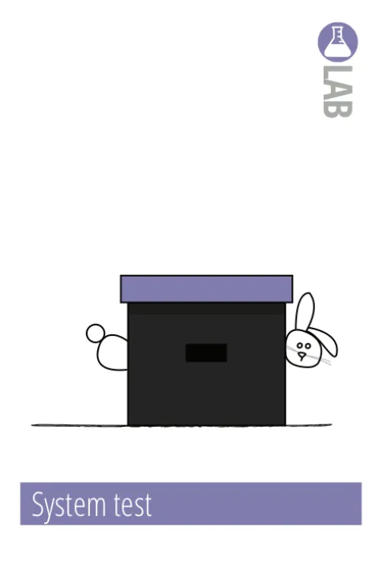

# Onderzoeksplan - Hightlight.io

## Inleiding

Ik heb ChatGPT gevraagd om een onderzoeksvraag en deelvragen te bedenken voor mijn onderzoek. Ik heb deze gefinetuned om beter aan te sluiten bij mijn onderzoek. Ik heb de onderzoeksmethoden bedacht die ik ga gebruiken om de onderzoeksvraag en deelvragen te beantwoorden.

Dit onderzoek past bij week 5 - SlackOps, omdat ik onderzoek doe naar een tool die gebruikt kan worden voor monitoring en foutopsporing in een microservices-architectuur. Dit is relevant voor DevOps, omdat monitoring en foutopsporing belangrijke aspecten zijn van het beheren van applicaties in productie.

Vervolgens heb ik de resultaten voor het onderzoek laten genereren door ChatGPT. Deze resultaten werk ik verder uit in mijn onderzoeksverslag.

## Onderzoeksvraag

### Hoofdvraag

Hoe zorgt Highlight.io voor effectieve monitoring en foutopsporing in een microservices-applicatie?

### Deelvragen

1. Wat zijn de kernfunctionaliteiten van de tool?
2. Hoe integreer je de tool in de frontend van een microservices-applicatie?
3. Hoe ziet deze integratie in de frontend eruit?
4. Hoe pas je de tool in je backend toe in C# en Java?
5. Hoe ziet deze integratie in de backend eruit?
6. Welke uitdagingen zijn er bij het implementeren van de tool in een microservices-architectuur?

## Onderzoeksmethoden

### 1. Wat zijn de kernfunctionaliteiten van de tool?


Om de kernfunctionaliteiten van Highlight.io te achterhalen, wordt er een literatuurstudie uitgevoerd. Hierbij wordt de documentatie van Highlight.io bestudeerd en worden er eventueel andere bronnen geraadpleegd.

### 2. Hoe integreer je de tool in de frontend van een microservices-applicatie?


Om vervolgens helder te krijgen hoe de tool in de frontend van een microservices-applicatie geïntegreerd kan worden, wordt er een literatuurstudie uitgevoerd. Hierbij wordt de documentatie van Highlight.io bestudeerd en worden er eventueel andere bronnen geraadpleegd.

### 3. Hoe ziet deze integratie in de frontend eruit?



De onderzochte informatie wordt vervolgens toegepast in een systeemtest. Hierbij wordt de integratie van Highlight.io in de frontend van een microservices-applicatie getest.

### 4. Hoe pas je de tool in je backend toe in C# en Java?


Om te achterhalen hoe de tool in de backend van een microservices-applicatie toegepast kan worden, wordt er een literatuurstudie uitgevoerd. Hierbij wordt de documentatie van Highlight.io bestudeerd en worden er eventueel andere bronnen geraadpleegd.

### 5. Hoe ziet deze integratie in de backend eruit?


De onderzochte informatie wordt vervolgens toegepast in een systeemtest. Hierbij wordt de integratie van Highlight.io in de backend van een microservices-applicatie getest.

### 6. Welke uitdagingen zijn er bij het implementeren van de tool in een microservices-architectuur?


Om de uitdagingen bij het implementeren van Highlight.io in een microservices-architectuur in kaart te brengen, wordt er een probleemanalyse uitgevoerd. Hierbij worden de resultaten van de literatuurstudies en systeemtests geanalyseerd.

## Resultaten

### 1. Wat zijn de kernfunctionaliteiten van de tool?

Highlight.io is een observability-tool die helpt bij het monitoren en debuggen van frontend webapplicaties. De kernfunctionaliteiten zijn:

* **Session replay:** Deze functie legt gebruikerssessies vast, zodat je interacties en acties in de browser kunt terugkijken. Dit is handig voor het debuggen van UI-problemen en het begrijpen van gebruikersgedrag.
* **Error tracking:** Realtime monitoring en rapportage van fouten (JavaScript-errors, network failures, etc.) in de frontend. Dit helpt om problemen snel te detecteren en te verhelpen.
* **Logging en metrics:** Het verzamelen van loggegevens en prestatiemetrics om de gezondheid en prestaties van je applicatie te volgen.
* **Performance monitoring:** Houdt laadtijden, reactietijden en andere prestatie-indicatoren van de frontend in de gaten.
* **Custom events:** Je kunt eigen events definiëren om specifieke interacties of gebeurtenissen in de applicatie te volgen.

### 2. Hoe integreer je de tool in de frontend van een microservice-applicatie?

Om Highlight.io te integreren in de frontend van een microservices-applicatie, doorloop je een paar stappen die beginnen met het toevoegen van de officiële SDK voor je frontend framework, zoals React, Vue, of Angular. De installatie gebeurt meestal via een package manager zoals npm. Na de installatie configureer je de SDK met je unieke project-ID, die je verkrijgt vanuit het Highlight.io dashboard.

Na configuratie zorgt de SDK ervoor dat sessies automatisch worden opgenomen, errors worden getrackt, en logging plaatsvindt. Je kunt daarnaast de tool verder aanpassen door bijvoorbeeld eigen events of user-identificatie toe te voegen. Deze integratie gebeurt vaak in het entry-point of de hoofdcomponent van de applicatie, zoals App.js in React of het hoofdbestand van een andere framework.

Zodra de tool is geïntegreerd, worden alle gebruikerssessies, interacties en eventuele JavaScript-fouten automatisch naar Highlight.io gestuurd voor analyse. Dit geeft inzicht in zowel gebruikspatronen als performanceproblemen in de frontend van de applicatie.

### 3. Hoe ziet deze integratie in de frontend eruit?

Hieronder staat een voorbeeld van de integratie van Highlight.io in een React-applicatie. Dit laat zien hoe je de SDK kunt toevoegen en configureren, zodat sessies en errors automatisch worden gelogd.

```javascript
import { H } from '@highlight-run/react';
import React from 'react';
import ReactDOM from 'react-dom';
import App from './App';

// Initialiseer Highlight.io met jouw project-ID
H.init('YOUR_PROJECT_ID', {
  environment: process.env.NODE_ENV,  // Geeft de huidige omgeving aan (bijv. productie of staging)
  tracingOrigins: true, // Optioneel, om network tracing toe te voegen
});

// Start het opnemen van sessies en het vastleggen van errors
H.start();

ReactDOM.render(
  <React.StrictMode>
    <App />
  </React.StrictMode>,
  document.getElementById('root')
);
```

Dit voorbeeld vangt sessies en fouten op wanneer de gebruiker de applicatie gebruikt en stuurt deze naar Highlight.io.

### 4. Hoe pas je de tool in je backend toe in C# en Java?

Hoewel Highlight.io primair is gericht op frontend-observability, kun je het in de backend integreren om een full-stack monitoringoplossing te creëren. Dit kan door gebruik te maken van de Highlight.io SDK voor Node.js in backend-applicaties die op JavaScript of TypeScript draaien, of door custom error logging te implementeren in andere talen, zoals C# en Java.

In backends zoals C# of Java stuur je errors of logs via API-verzoeken naar Highlight.io. Dit geeft inzicht in hoe backend-events zoals serverfouten invloed hebben op de frontend-ervaring. Deze integratie vergt wel wat extra configuratie, zoals het opzetten van correlatie tussen frontend-gebruikerssessies en backend-fouten, zodat je problemen in beide lagen kunt volgen.

### 5. Hoe ziet deze integratie in de backend eruit?

Voor de integratie in een Node.js backend kun je gebruik maken van de officiële Highlight.io SDK. Hieronder een voorbeeld:

```javascript
import H from '@highlight-run/node';

// Initialiseer Highlight.io met je project-ID
H.init({
  projectID: 'YOUR_PROJECT_ID',
  serviceName: 'backend-service',  // Naam van de service die je wilt volgen
});

// Start de integratie van Highlight.io
H.start();

// Voorbeeld van het gebruik binnen een express app
import express from 'express';
const app = express();

// Middleware om requests te loggen
app.use(H.expressMiddleware());

app.get('/', (req, res) => {
  res.send('Hello from Highlight.io integrated backend!');
});

app.listen(3000, () => {
  console.log('Server is running on port 3000');
});
```

Dit voorbeeld laat zien hoe je Highlight.io kunt integreren in een Node.js backend om requests en errors vast te leggen. Fouten worden automatisch naar Highlight.io gestuurd en je kunt gedetailleerde logging en tracing bekijken in de Highlight.io interface.

Voor backends in C# of Java kun je gebruik maken van HTTP-verzoeken om errors handmatig te loggen, hoewel er geen native SDK’s beschikbaar zijn.

### 6. Welke uitdagingen zijn er bij het implementeren van de tool in een microservices-architectuur?

De implementatie van Highlight.io in een microservices-architectuur kan uitdagingen met zich meebrengen:

* **Sessies traceren tussen services:** Aangezien Highlight.io zich primair op de frontend richt, kan het lastig zijn om een gebruiker consistent te volgen wanneer verschillende backend-services betrokken zijn. Het is belangrijk om een goede correlation ID of user ID-strategie te implementeren die zowel in de frontend als backend gebruikt kan worden.
* **Performance overhead:** Het continu verzenden van logs, errors en sessiegegevens kan invloed hebben op de prestaties van je frontend- en backend-services, vooral bij grote hoeveelheden gebruikers en gegevens.
* **Security en privacy:** Omdat Highlight.io gebruikerssessies opneemt, is het essentieel om zorgvuldig om te gaan met gevoelige informatie. Zorg ervoor dat je voldoet aan privacywetgeving (zoals GDPR) en dat je gevoelige gegevens filtert uit de sessie-opnames en logs.
* **Configuratiebeheer:** In een microservices-omgeving moet je Highlight.io correct configureren voor elke service. Dit kan complex zijn, vooral als je meerdere omgevingen en deploys hebt. Automatisering en goede documentatie zijn essentieel.

Met deze richtlijnen kun je Highlight.io effectief inzetten voor frontend- en backend-monitoring in een microservices-applicatie.

## Bronnen

* OpenAI. (2024). ChatGPT (4 Okt. versie) [Large language model]. https://chat.openai.com/chat
* Hbo-I. (z.d.). ICT Research Methods — Methods Pack for Research in ICT. ICT Research Methods. https://ictresearchmethods.nl/
