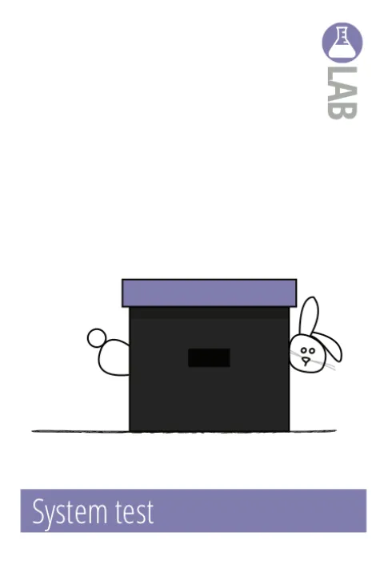

# Onderzoeksplan - Highlight.io

* Door: Stijn Bannink

## Inleiding

Ik heb ChatGPT gevraagd om een onderzoeksvraag en deelvragen te bedenken voor mijn onderzoek. Ik heb deze gefinetuned om beter aan te sluiten bij mijn onderzoek. Ik heb vervolgens zelf de onderzoeksmethoden bedacht die ik ga gebruiken om de onderzoeksvraag en deelvragen te beantwoorden.

Dit onderzoek past bij week 5 - SlackOps, omdat ik onderzoek doe naar een tool die gebruikt kan worden voor monitoring en foutopsporing in een microservices-architectuur. Dit is relevant voor DevOps, omdat monitoring en foutopsporing belangrijke aspecten zijn van het beheren van applicaties in productie.

## Onderzoeksvraag

### Hoofdvraag

Hoe zorgt Highlight.io voor effectieve monitoring en foutopsporing in een microservices-applicatie?

### Deelvragen

1. Wat zijn de kernfunctionaliteiten van de tool?
2. Hoe integreer je de tool in de frontend van een microservices-applicatie?
3. Hoe ziet deze integratie in de frontend eruit?
4. Hoe pas je de tool in je backend toe in C# en Java?
5. Hoe ziet deze integratie in de backend eruit?
6. Welke uitdagingen zijn er bij het implementeren van de tool in een microservices-architectuur?

## Onderzoeksmethoden

### 1. Wat zijn de kernfunctionaliteiten van de tool?

Om de kernfunctionaliteiten van Highlight.io te achterhalen, wordt er een literatuurstudie uitgevoerd. Hierbij wordt de documentatie van Highlight.io bestudeerd en worden er eventueel andere bronnen geraadpleegd.

### 2. Hoe integreer je de tool in de frontend van een microservices-applicatie?

Om vervolgens helder te krijgen hoe de tool in de frontend van een microservices-applicatie geïntegreerd kan worden, wordt er een literatuurstudie uitgevoerd. Hierbij wordt de documentatie van Highlight.io bestudeerd en worden er eventueel andere bronnen geraadpleegd.

### 3. Hoe ziet deze integratie in de frontend eruit?

De onderzochte informatie wordt vervolgens toegepast in een systeemtest. Hierbij wordt de integratie van Highlight.io in de frontend van een microservices-applicatie getest.

### 4. Hoe pas je de tool in je backend toe in C# en Java?

Om te achterhalen hoe de tool in de backend van een microservices-applicatie toegepast kan worden, wordt er een literatuurstudie uitgevoerd. Hierbij wordt de documentatie van Highlight.io bestudeerd en worden er eventueel andere bronnen geraadpleegd.

### 5. Hoe ziet deze integratie in de backend eruit?

De onderzochte informatie wordt vervolgens toegepast in een systeemtest. Hierbij wordt de integratie van Highlight.io in de backend van een microservices-applicatie getest.

### 6. Welke uitdagingen zijn er bij het implementeren van de tool in een microservices-architectuur?

Om de uitdagingen bij het implementeren van Highlight.io in een microservices-architectuur in kaart te brengen, wordt er een probleemanalyse uitgevoerd. Hierbij worden de resultaten van de literatuurstudies en systeemtests geanalyseerd.

## Bronnen

* OpenAI. (2024). ChatGPT (4 Okt. versie) [Large language model]. https://chat.openai.com/chat
* Hbo-I. (z.d.). ICT Research Methods — Methods Pack for Research in ICT. ICT Research Methods. https://ictresearchmethods.nl/
